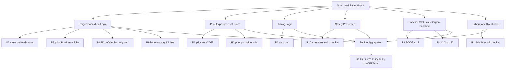

# Phase III Eligibility Prescreen Engine


A rule-based clinical trial prescreening proof of concept that operationalizes key eligibility criteria into executable, explainable, and testable decision logic.

> This repository is a prescreening **PoC**, not a full protocol engine and not a substitute for investigator or clinician judgment.

---

## Table of Contents

- [Project Summary](#project-summary)
- [Why This Project Matters](#why-this-project-matters)
- [Key Features](#key-features)
- [Skills Demonstrated](#skills-demonstrated)
- [Current Scope](#current-scope)
- [Rule Architecture](#rule-architecture)
- [Repository Structure](#repository-structure)
- [Quick Start](#quick-start)
- [Example Output](#example-output)
- [Testing](#testing)
- [Design Choices](#design-choices)
- [Protocol Mapping Layer](#protocol-mapping-layer)
- [Limitations](#limitations)
- [Roadmap](#roadmap)
- [Why This Works as a Portfolio Project](#why-this-works-as-a-portfolio-project)
- [Author](#author)
- [License](#license)

---

## Project Summary

Clinical trial eligibility screening is often operationally difficult:

- eligibility criteria are written in protocol language,
- patient information is often incomplete,
- manual review is time-consuming,
- and screening decisions are not always easy to audit consistently.

This repository is a **proof of concept** showing how protocol-style eligibility logic can be translated into a modular Python rule engine.

Given a structured patient record, the engine:

- evaluates implemented eligibility rules one by one,
- returns a tri-state prescreen verdict,
- explains which rules passed or failed,
- and highlights missing fields that prevent confident screening.

The current implementation is framed as a **prescreen workflow**, not final enrollment adjudication.

---

## Why This Project Matters

A large part of trial screening difficulty is not that the logic is impossible, but that the logic is rarely operationalized clearly.

This project focuses on a practical question:

> How do you turn protocol-style eligibility text into auditable, testable software logic?

That requires more than writing `if/else` statements. It requires:

- decomposing ambiguous requirements,
- defining explicit decision boundaries,
- handling missing data conservatively,
- keeping rules modular,
- and producing outputs that humans can review.

That is the problem this project is trying to solve at PoC scale.

---

## Key Features

- **Rule-based prescreening engine**
- **Tri-state output**: `PASS`, `NOT_ELIGIBLE`, `UNCERTAIN`
- **Explicit missing-field handling**
- **Rule-by-rule explainability**
- **Bucket-based aggregation for realistic pre-screen logic**
- **Pytest-based validation**
- **Protocol-to-rule mapping layer**
- **Designed for transparency rather than black-box scoring**

---

## Skills Demonstrated

This repository is intended to demonstrate the following capabilities:

### Clinical / domain logic
- Translating eligibility criteria into structured decision rules
- Converting protocol language into operational screening logic
- Distinguishing prescreen logic from final eligibility review

### Software engineering
- Rule-based architecture
- Separation of rule logic and engine logic
- Modular extension as rule coverage grows
- Automated testing with `pytest`

### Decision-system design
- Tri-state reasoning instead of forced binary output
- Conservative handling of missing data
- Deterministic and auditable outputs
- Bucket design for grouped exclusion and lab logic

### Product / workflow thinking
- Designing outputs for human review
- Making assumptions explicit
- Preserving traceability from protocol intent to code behavior

---

## Current Scope

This repository currently implements a subset of high-value eligibility logic in a Phase III oncology prescreen prototype.

At present, the PoC covers **R1–R11**, including:

- prior treatment exposure exclusions,
- baseline status and organ function checks,
- washout timing logic,
- measurable disease logic,
- prior-treatment and response-history requirements,
- progression status checks,
- safety exclusion bucket logic,
- laboratory threshold bucket logic,
- missing-information escalation to `UNCERTAIN`.

This is enough to demonstrate the core architecture and screening approach, but it is **not** intended to represent complete protocol coverage.

### Implemented rules

| Rule ID | Name | Type | Description |
|---|---|---|---|
| R1 | prior anti-CD38 exclusion | Exclusion | prior anti-CD38 exposure |
| R2 | prior pomalidomide exclusion | Exclusion | prior pomalidomide exposure |
| R3 | ECOG ≤ 2 | Inclusion | baseline performance status |
| R4 | CrCl ≥ 30 | Inclusion | renal function threshold |
| R5 | washout | Exclusion / timing | anti-myeloma treatment washout |
| R6 | measurable disease | Inclusion | measurable disease requirement |
| R7 | prior PI + Len + PR+ | Inclusion | prior regimen and response requirement |
| R8 | PD on/after last regimen | Inclusion | progression status requirement |
| R9 | len refractory if 1 line | Inclusion | extra condition when prior therapy is limited |
| R10 | safety exclusion bucket | Aggregated exclusion | infection / cardiovascular / surgery-type safety items |
| R11 | lab threshold bucket | Aggregated inclusion | ANC / Hb / platelets / liver function / bilirubin-style thresholds |

---

## Rule Architecture

The current implementation uses a layered design rather than treating all criteria as a flat checklist.



    > This structure reflects a practical prescreening mindset:
    > - some rules are simple single checks,
    > - some logic is better modeled as grouped buckets,
    > - and the engine aggregates them into one reviewable result.

## Repository Structure

    trialmatch/
    ├─ eligibility/
    │  ├─ __init__.py
    │  ├─ rules.py          # individual rule implementations
    │  ├─ engine.py         # rule execution and final aggregation
    │  └─ trial_meta.py     # protocol-to-rule mapping / rule metadata
    ├─ tests/
    │  └─ test_engine.py    # unit tests
    ├─ run.py               # demo entry point
    ├─ screen_step1.py      # early single-rule prototype kept for reference
    ├─ pytest.ini
    └─ README.md

```
> The repository preserves both:
> - an early minimal prototype (screen_step1.py), 
> - the multi-rule engine structure used for the current PoC,
> - That progression is intentional. It shows how the project evolved from a single-rule check into a more extensible rule engine.

```
## Quick Start

### 1. Clone the repository
```bash
git clone <YOUR_REPOSITORY_URL>
cd phase3-eligibility-prescreen-engine
```

### 2. Create and activate a virtual environment

**Windows PowerShell**
```powershell
python -m venv .venv
.\.venv\Scripts\Activate.ps1
```

### 3. Install dependencies
```bash
python -m pip install -r requirements.txt
```

If you are using a minimal dependency setup, you may only need:
```bash
python -m pip install pytest
```

### 4. Run the demo
```bash
python run.py
```

### 5. Run the tests
```bash
python -m pytest -q
```

## Example Output

A typical engine response looks like this:
```json
{
    "verdict": "PASS",
    "reason": "Passed all implemented rules (not final eligibility)",
    "missing": [],
    "details": [
        {
            "rule_id": "R6_measurable_disease",
            "verdict": "PASS",
            "reason": "Measurable disease threshold satisfied",
            "missing": []
        },
        {
            "rule_id": "R7_prior_PI_len_PRplus",
            "verdict": "PASS",
            "reason": "Required prior treatment and response history satisfied",
            "missing": []
        }
    ]
}
```

### Output Semantics

| Verdict | Meaning |
|---------|---------|
| `PASS` | The patient passed all currently implemented rules. |
| `NOT_ELIGIBLE` | At least one implemented exclusion or fail condition was triggered. |
| `UNCERTAIN` | No hard failure was found, but key information is missing. |

> This is deliberate. In real prescreen workflows, incomplete information is common,
> and a forced yes/no output can be misleading.

---

## Testing

This project uses `pytest` to validate both:

- individual rule behavior, and
- multi-rule aggregation logic.

Testing currently focuses on:

- positive pass cases,
- fail / exclusion cases,
- uncertain cases caused by missing data,
- consistency of rule-level reasoning, and
- aggregation behavior across multiple rules.

> The goal is not only for the code to run, but for the screening logic to remain
> stable and reviewable as more criteria are added.
